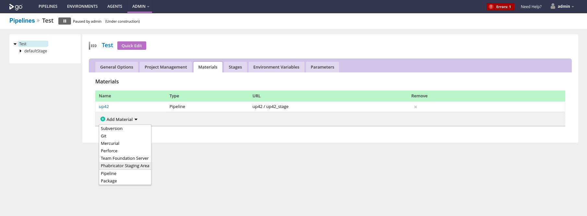
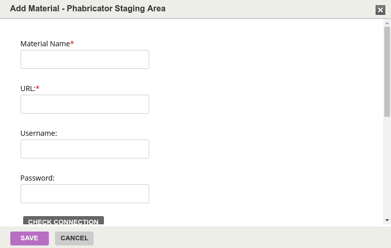

# gocd-phabricator-staging-material
GoCD SCM plugin for handling Phabricator staging areas.

## Requirements

[GoCD](https://gocd.org) >= 17.4.0

## Installation
1. Download the plugin from [Releases](https://github.com/kszatan/gocd-phabricator-staging-material/releases).
2. Follow [plugin installation instructions](https://docs.gocd.org/current/extension_points/plugin_user_guide.html).

## Usage
* Go to "Edit pipeline" view and choose "Materials" tab then click 'Add Material'

* Fill out form with URL and credentials of a Phabricator staging area.

## Caveats
* Due to a [bug](https://github.com/gocd/gocd/issues/2947) in GoCD, plugin materials are not visible when creating a new pipeline.
* GoCD is [not able to manage SSH keys](https://github.com/gocd/gocd/issues/430) so this plugin won't work with
password-protected SSH keys. Passwordless keys need some [work](https://github.com/gocd/gocd/issues/1815).
